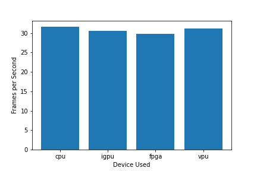
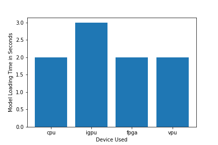
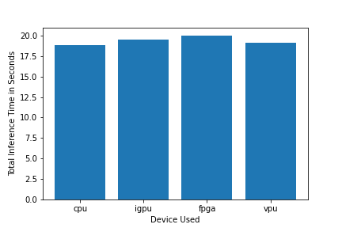
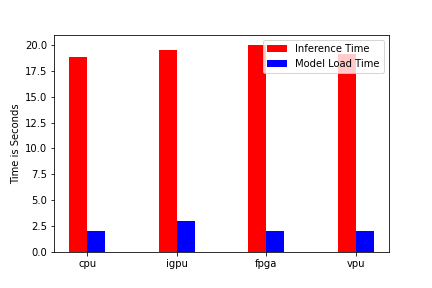
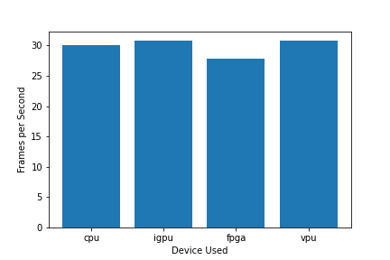
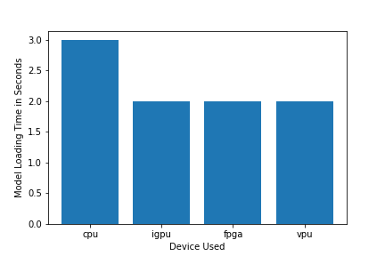
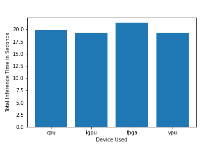
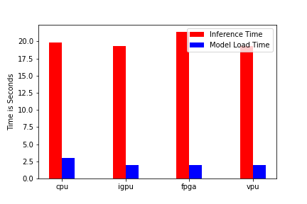

# Computer Pointer Controller
Project is to control the mouse pointer of your computer using gaze estimation model. 
You will be using the InferenceEngine API from Intel's OpenVino ToolKit to build the project. The gaze estimation model requires three inputs:
* The head pose
* The left eye image
* The right eye image.

To get these inputs, you will have to use three other OpenVino models:
* [Face Detection](https://docs.openvinotoolkit.org/latest/_models_intel_face_detection_adas_binary_0001_description_face_detection_adas_binary_0001.html)
* [Head Pose Estimation](https://docs.openvinotoolkit.org/latest/_models_intel_head_pose_estimation_adas_0001_description_head_pose_estimation_adas_0001.html)
* [Facial Landmarks Detection](https://docs.openvinotoolkit.org/latest/_models_intel_landmarks_regression_retail_0009_description_landmarks_regression_retail_0009.html)

## The Pipeline

You will have to coordinate the flow of data from the input, and then amongst the different models and finally to the mouse controller. The flow of data will look like this:


## Project Set Up and Installation
* Follow the guidelines to install the [openVino](https://docs.openvinotoolkit.org/latest/index.html)
* Clone this repo and just follow the [how-to-run](how-to-run.md)

## Running applicaitno (Demo)
* Check [how-to-run](how-to-run.md)


## Documentation
Enable the virtual environment:

```
source /opt/intel/openvino/bin/setupvars.sh
```

Install the requirements:

```
pip install -e requirements.txt
```

* Run command `python3 main.py -h` to get the supported arguments
* Inference Engine API Docs [here](https://docs.openvinotoolkit.org/latest/_inference_engine_ie_bridges_python_docs_api_overview.html)
* Model documentation [here](https://docs.openvinotoolkit.org/latest/_models_intel_index.html) 

## Benchmarks
I run this model on 4 different hardware using Intel-dev cloud. Below is the list of hardware used and their results.

CPU: https://ark.intel.com/products/88186/Intel-Core-i5-6500TE-Processor-6M-Cache-up-to-3-30-GHz-

IGPU: https://ark.intel.com/products/88186/Intel-Core-i5-6500TE-Processor-6M-Cache-up-to-3-30-GHz-

VPU: https://software.intel.com/en-us/neural-compute-stick

FPGA: https://www.ieiworld.com/mustang-f100/en/


**Results with Model Precision-FP32:**

FPS Graph                  |  Model load time plot
:-------------------------:|:-------------------------:
  |  

Inference time plot        |  Combine graph for all 
:-------------------------:|:-------------------------:
  |    
</br>

**Results with Model Precision-FP16:**

FPS Graph                  |  Model load time plot
:-------------------------:|:-------------------------:
  |  

Inference time plot        |  Combine graph for all 
:-------------------------:|:-------------------------:
  |  


NOTE: I have attached the expected working python notebook to run this experiment on multiple devices. Check it [here](src/computer-controller.ipynb)

## Results
As clear from the above results, total inference time and model load time is almost equal for all the device.

To run this model on intel-dev-cloud platform, use this [notebook](src/computer-controller.ipynb) and follow the guidlines from [how-to-run](how-to-run.md)

## Stand Out Suggestions
This is where you can provide information about the stand out suggestions that you have attempted.

### Async Inference
If you have used Async Inference in your code, benchmark the results and explain its effects on power and performance of your project.

### Edge Cases
There will be certain situations that will break your inference flow. For instance, lighting changes or multiple people in the frame. Explain some of the edge cases you encountered in your project and how you solved them to make your project more robust.
